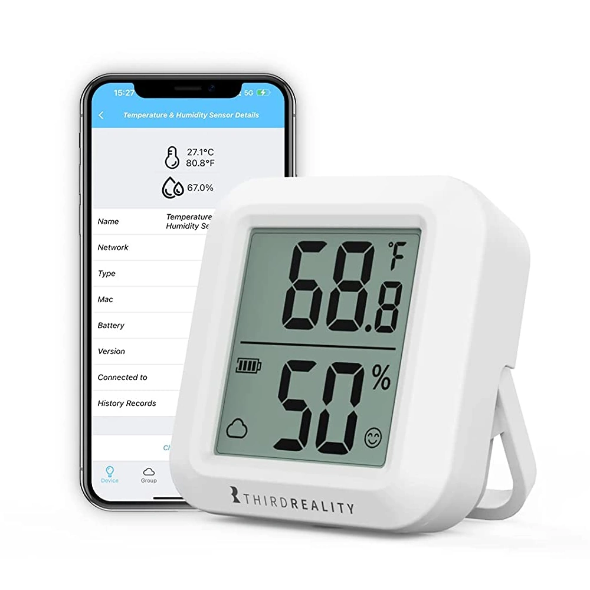
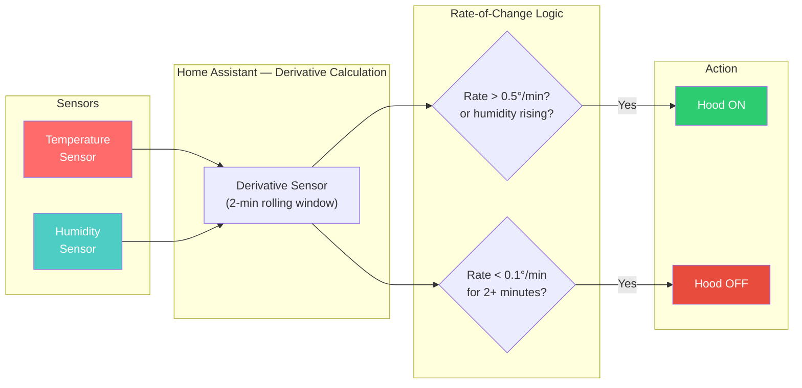
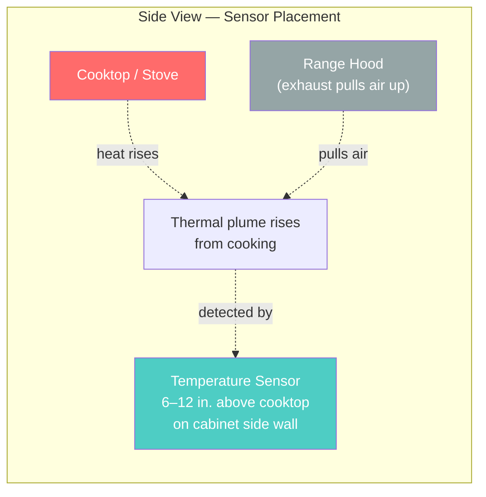

<h1 align="center">Smart Hood Vent Automation<br/>for Home Assistant</h1>

<p align="center">
  <strong>Automatically turn your range hood on and off based on cooking activity — no hardwired stove integration required.</strong>
</p>

<p align="center">
  <a href="https://www.home-assistant.io/"></a>
  <a href="https://github.com/azilnik/ha-smart-hood-vent/blob/main/LICENSE"></a>
  <a href="https://github.com/azilnik/ha-smart-hood-vent/stargazers"></a>
</p>

---

## Table of Contents

- [What This Does](#what-this-does)
- [Before You Start — Prerequisites](#before-you-start--prerequisites)
- [Hardware Shopping List](#hardware-shopping-list)
- [How It Works](#how-it-works)
- [Step-by-Step Installation](#step-by-step-installation)
- [Where to Mount the Sensor](#where-to-mount-the-sensor)
- [Adding the Dashboard Card](#adding-the-dashboard-card)
- [Tuning the Sensitivity](#tuning-the-sensitivity)
- [Features](#features)
- [Troubleshooting](#troubleshooting)
- [Contributing](#contributing)
- [License](#license)

---

## What This Does

Most "smart hood" automations trigger when the kitchen hits a temperature threshold (e.g., 25 °C). The problem: temperature is a **lagging indicator**. By the time the air is warm, you've been cooking for minutes. And when you stop, residual heat keeps the sensor warm long after the stove is off.

This package takes a different approach. Instead of watching absolute temperature, it watches the **rate of change** — how *fast* the temperature is rising or falling. When the stove is on, temperature climbs quickly. When it's off, the rate drops to zero or goes negative, even if the kitchen is still warm.

**The result:** your hood turns on within 30–60 seconds of starting to cook and turns off within 2–3 minutes of stopping — instead of the 10–15 minute lag you get with threshold-based automations.

---

## Before You Start — Prerequisites

This project assumes you have a few things already set up. If any of these are new to you, follow the linked guides first.

### 1. A Home Assistant server running at home

Home Assistant (HA) is free, open-source software that runs on a dedicated device in your house — like a Raspberry Pi, an old laptop, or a mini PC. It's the brain that connects all your smart devices together locally, without relying on cloud services.

**You need HA installed and running before using this project.**

If you don't have it yet, start here:
- [What is Home Assistant?](https://www.home-assistant.io/getting-started/) — 5-minute overview of what it does
- [Installation guide](https://www.home-assistant.io/installation/) — pick your hardware and follow the steps
- [Onboarding walkthrough](https://www.home-assistant.io/getting-started/onboarding/) — first-time setup after installation
- [Concepts & terminology](https://www.home-assistant.io/getting-started/concepts-terminology/) — entities, automations, integrations, and other key terms

> **Recommended hardware for beginners:** A [Raspberry Pi 4 (4 GB)](https://www.home-assistant.io/installation/raspberrypi) or an [Intel NUC / mini PC](https://www.home-assistant.io/installation/generic-x86-64) running Home Assistant OS. Either will handle this project and much more.

### 2. A Zigbee coordinator

Zigbee is the wireless protocol your temperature sensor uses to talk to Home Assistant. You need a small USB dongle or network device (called a "coordinator") plugged into your HA server to receive Zigbee signals.

If this is your first Zigbee device, these guides walk through setup:
- [ZHA integration guide](https://www.home-assistant.io/integrations/zha/) — HA's built-in Zigbee support (easiest to set up)
- [Zigbee2MQTT](https://www.zigbee2mqtt.io/guide/getting-started/) — alternative with more advanced device support

### 3. Basic YAML comfort

You'll need to copy files and edit a few entity IDs in YAML. You don't need to write YAML from scratch — just find-and-replace some placeholder values. If you've never touched YAML before:
- [HA's YAML intro](https://www.home-assistant.io/docs/configuration/yaml/) — syntax basics
- [File Editor add-on](https://www.home-assistant.io/common-tasks/os/#installing-and-using-the-file-editor-add-on) — edit config files right in your browser (no SSH needed)

---

## Hardware Shopping List

You need three things: a temperature sensor, something to press your hood's button, and a Zigbee coordinator (if you don't already have one).

### Temperature & Humidity Sensor

This is the "eyes" of the automation — it detects cooking activity by measuring how fast the air is heating up.

<table>
  <tr>
    <td width="140"></td>
    <td>
      <strong><a href="https://www.amazon.com/THIRDREALITY-Zigbee-Temperature-Humidity-Sensor/dp/B0BN32XX24">Third Reality Zigbee Temperature & Humidity Sensor</a></strong><br/>
      Reports temperature and humidity over Zigbee. Compact, battery-powered, easy to mount near the stove. Has a small LCD screen so you can glance at the reading.<br/>
      <strong>~$20</strong>
    </td>
  </tr>
</table>

<details>
<summary><strong>Alternative sensors</strong></summary>
<br/>

| Sensor | Notes | Price |
|--------|-------|-------|
| [Third Reality Sensor Lite](https://www.amazon.com/THIRDREALITY-Temperature-Humidity-Sensor-Lite/dp/B0F6CKHHDV) | Same accuracy, no LCD screen | ~$15 |
| [SONOFF SNZB-02](https://www.amazon.com/SONOFF-SNZB-02-Temperature-Humidity-Sensor/dp/B08BCHRH1P) | Very compact, wide HA support | ~$12 |

Any Zigbee temperature sensor that reports to HA will work. The key is frequent reporting intervals (ideally every 30–60 seconds).

</details>

### Hood Control (SwitchBot)

Unless your hood vent is already wired into a smart switch, you need a physical way to press the button. A SwitchBot Bot is a tiny robotic arm that mounts over your existing hood button and presses it on command.

<table>
  <tr>
    <td width="140"></td>
    <td>
      <strong><a href="https://www.amazon.com/SwitchBot-switch-button-controlled-compatible/dp/B07B7NXV4R">SwitchBot Bot</a></strong><br/>
      A tiny motorized arm that physically presses buttons. Sticks onto your hood with adhesive — no wiring, no modification to your hood.<br/>
      <strong>~$30</strong>
    </td>
  </tr>
  <tr>
    <td width="140"></td>
    <td>
      <strong><a href="https://www.amazon.com/SwitchBot-Thermometer-Hygrometer-Bluetooth-Temperature/dp/B07TTH451R">SwitchBot Hub Mini</a></strong><br/>
      The Bot communicates over Bluetooth, but the Hub bridges it to your Wi-Fi network so Home Assistant can control it. You need one Hub for all your SwitchBot devices.<br/>
      <strong>~$40</strong><br/><br/>
      <em>Setup guide:</em> <a href="https://www.home-assistant.io/integrations/switchbot/">SwitchBot HA integration</a>
    </td>
  </tr>
</table>

<details>
<summary><strong>Alternative hood controls</strong></summary>
<br/>

If your hood is hardwired (i.e., it's controlled by a wall switch rather than a button on the hood itself), you can use a smart relay instead:

| Device | Notes | Price |
|--------|-------|-------|
| Any Zigbee smart switch | Replaces your wall switch entirely | $15–30 |
| [Shelly Plus 1](https://www.shelly.com/en/products/shop/shelly-plus-1) | Wi-Fi relay, wires behind the switch | ~$12 |

</details>

### Zigbee Coordinator

This is the "radio" that lets Home Assistant talk to your Zigbee sensor. If you already use Zigbee devices with HA, you already have one — skip this.

<table>
  <tr>
    <td width="140"></td>
    <td>
      <strong><a href="https://www.amazon.com/SMLIGHT-SLZB-06-Coordinator-Zigbee2MQTT-Assistant/dp/B0BL6DQSB3">SMLIGHT SLZB-06</a></strong><br/>
      Connects over Ethernet, USB, or Wi-Fi. Supports PoE. Can be placed anywhere in your house for best Zigbee coverage — doesn't need to be plugged into the HA server directly.<br/>
      <strong>~$45</strong>
    </td>
  </tr>
</table>

<details>
<summary><strong>Alternative coordinators</strong></summary>
<br/>

| Coordinator | Notes | Price |
|-------------|-------|-------|
| [SONOFF Zigbee 3.0 USB Dongle Plus](https://www.amazon.com/SONOFF-Zigbee-Gateway-Universal-Assistant/dp/B09KXTCMSC) | Budget USB option, widely recommended for beginners | ~$25 |
| [SMLIGHT SLZB-06M](https://www.amazon.com/SMLIGHT-SLZB-06M-Ethernet-Zigbee2MQTT-Assistant/dp/B0CLCGV1RZ) | EFR32 chip variant of the SLZB-06 | ~$45 |

For help choosing, see the [Zigbee coordinator comparison](https://www.zigbee2mqtt.io/guide/adapters/) on the Zigbee2MQTT site.

</details>

### Total Cost

| Item | Price |
|------|-------|
| Temperature sensor | ~$20 |
| SwitchBot Bot | ~$30 |
| SwitchBot Hub Mini | ~$40 |
| Zigbee coordinator (if needed) | ~$45 |
| **Total** | **~$90–135** |

One-time purchase. No subscriptions. Everything runs locally.

---

## How It Works

Most automations watch for a **temperature threshold** (e.g., "turn on when kitchen hits 26 °C"). This is slow because temperature lags behind actual cooking activity.

This package watches the **rate of change** — how many degrees the temperature changes per minute. It uses Home Assistant's built-in [derivative sensor](https://www.home-assistant.io/integrations/derivative/) to calculate this over a 2-minute rolling window.



**Why rate of change works better:**

| Scenario | Threshold-based | Rate-of-change (this project) |
|----------|----------------|-------------------------------|
| Start cooking | Waits until kitchen heats up (5–10 min) | Detects rising temp within 30–60 sec |
| Stop cooking | Waits for kitchen to cool down (10–15 min) | Detects rate dropping within 2–3 min |
| Hot day, kitchen already warm | May trigger falsely | Ignores — temp isn't *changing* fast |
| Open oven to check food | May trigger from heat blast | Brief spike smoothed by 2-min window |

---

## Step-by-Step Installation

### Step 1: Set up the packages directory

Home Assistant's [packages feature](https://www.home-assistant.io/docs/configuration/packages/) lets you keep all related configuration (sensors, automations, inputs) in a single file instead of splitting them across multiple config files. This project uses a package.

**1a.** Open your Home Assistant config directory. If you're using the [File Editor add-on](https://www.home-assistant.io/common-tasks/os/#installing-and-using-the-file-editor-add-on), click the folder icon in the left sidebar. If you're using SSH or Samba, navigate to `/config/`.

**1b.** Create a `packages` folder if it doesn't exist:

```
/config/
├── configuration.yaml
├── packages/              <-- create this folder
│   └── hood_vent_package.yaml   <-- you'll put the file here
└── ...
```

**1c.** Open `configuration.yaml` and add the packages include. If you already have a `homeassistant:` section, just add the `packages:` lines under it:

```yaml
homeassistant:
  packages:
    hood_vent: !include packages/hood_vent_package.yaml
```

> **Not sure how to edit configuration.yaml?** See [Editing the config](https://www.home-assistant.io/docs/configuration/) in the HA docs, or install the [File Editor add-on](https://www.home-assistant.io/common-tasks/os/#installing-and-using-the-file-editor-add-on) for a browser-based editor.

### Step 2: Copy the package file

Download [`hood_vent_package.yaml`](hood_vent_package.yaml) from this repo and place it in your `/config/packages/` directory.

### Step 3: Replace the placeholder entity IDs

Open `hood_vent_package.yaml` and find-and-replace three placeholder values with your actual entity IDs.

**How to find your entity IDs:** In Home Assistant, go to **[Developer Tools → States](https://my.home-assistant.io/redirect/developer_states/)** and search for your devices. Entity IDs look like `sensor.kitchen_temperature_humidity_temperature`.

| Find this placeholder | Replace with | Example |
|----------------------|--------------|---------|
| `sensor.YOUR_TEMPERATURE_SENSOR` | Your Zigbee temp sensor entity | `sensor.third_reality_kitchen_temperature` |
| `sensor.YOUR_HUMIDITY_SENSOR` | Your Zigbee humidity sensor entity | `sensor.third_reality_kitchen_humidity` |
| `switch.YOUR_HOOD_SWITCH` | Your SwitchBot or smart switch entity | `switch.switchbot_range_hood` |

> **Tip:** Use your editor's find-and-replace (Ctrl+H / Cmd+H) to catch all instances at once. Each placeholder appears multiple times.

### Step 4: Restart Home Assistant

Go to **[Settings → System → Restart](https://my.home-assistant.io/redirect/server_controls/)** and click "Restart." This loads your new package.

After restart, verify the new entities exist by going to **Developer Tools → States** and searching for `kitchen_temp` — you should see the derivative and rate-of-change sensors.

### Step 5: Enable the automation

Go to **[Settings → Automations](https://my.home-assistant.io/redirect/automations/)** and confirm you see these four automations:
- Hood Vent: Auto On
- Hood Vent: Auto Off
- Hood Vent: Detect Manual Override
- Hood Vent: Safety Auto Off (Max Runtime)

Make sure `input_boolean.hood_automation_enabled` is turned **on** (you can toggle it from **Developer Tools → States** or from the dashboard card you'll add next).

---

## Where to Mount the Sensor

Placement matters. The sensor needs to detect the **thermal plume** rising from your cooking — not direct burner heat or ambient room temperature.



**Good placement:**
- 6–12 inches above the cooktop, on a cabinet side wall or the underside of an upper cabinet
- Off to one side of the burners, not directly centered above one

**Bad placement (and why):**
- **Directly above a burner** — readings spike unrealistically high, causing false triggers
- **On the hood itself or near the exhaust vent** — airflow from the hood disrupts readings
- **Near a window, exterior door, or HVAC vent** — drafts cause false readings
- **Too far away (across the kitchen)** — sensor won't detect the cooking plume fast enough

> **Pro tip:** Use adhesive-backed command strips or Velcro for easy repositioning while you tune the placement.

---

## Adding the Dashboard Card

The dashboard card gives you a control panel with current readings, rate-of-change graphs, and tuning sliders.

### Step 1: (Optional) Install mini-graph-card

The full dashboard card uses [mini-graph-card](https://github.com/kalkih/mini-graph-card) from [HACS](https://hacs.xyz/) for rate-of-change visualization. This is optional — a simpler alternative card that works without HACS is included in the file.

If you want the enhanced graphs:
1. [Install HACS](https://hacs.xyz/docs/use/) if you don't have it
2. In HACS, search for "Mini Graph Card" and install it
3. Restart Home Assistant

### Step 2: Add the card

1. Download [`lovelace_card.yaml`](lovelace_card.yaml) from this repo
2. In your HA dashboard, click **Edit** (pencil icon top-right) → **Add Card** → scroll down to **Manual**
3. Paste the card YAML
4. **Find-and-replace** the same three placeholders you updated earlier (`YOUR_TEMPERATURE_SENSOR`, `YOUR_HUMIDITY_SENSOR`, `YOUR_HOOD_SWITCH`)
5. Save

> **New to dashboards?** See [HA's dashboard guide](https://www.home-assistant.io/dashboards/) for the basics.

---

## Tuning the Sensitivity

Every kitchen is different — sensor distance from the stove, ventilation, stove type (gas vs. electric vs. induction) all affect the readings. The dashboard card includes sliders to adjust thresholds without editing YAML.

### Default thresholds

| Setting | Default | What it controls |
|---------|---------|-----------------|
| Temp Rise Threshold | 0.5 °/min | How fast temp must rise to trigger the hood ON |
| Humidity Rise Threshold | 1.0 %/min | How fast humidity must rise to trigger ON |
| Temp Fall Threshold | 0.1 °/min | Rate below this means cooking has stopped |
| Off Delay | 2 min | How long the rate must stay low before the hood turns OFF |

### How to tune

1. **Turn off the automation** — toggle `input_boolean.hood_automation_enabled` to OFF
2. **Cook something** — boil water, pan-fry, whatever you normally make
3. **Watch the dashboard** — observe the "Temp Rate" and "Humidity Rate" values
4. **Note the peaks** — during active cooking, temp rate is typically 0.3–1.0 °/min
5. **Set the ON threshold** just below your observed peaks (e.g., if you see 0.6 °/min, set to 0.4)
6. **Turn off the stove** and watch the rate drop — it usually falls near zero within a minute or two
7. **Adjust the OFF threshold and delay** based on how quickly the rate drops
8. **Re-enable the automation** and test with real cooking

> **If the hood is too sensitive:** raise the temp rise threshold. **If it's not sensitive enough:** lower it. Start conservative (higher threshold) and work down.

---

## Features

| Feature | Description |
|---------|-------------|
| **Rate-of-change detection** | Responds to cooking activity, not absolute temperature — faster on, faster off |
| **Dual triggers** | Monitors both temperature and humidity for reliability (steam from boiling triggers humidity even if temp rise is slow) |
| **UI-adjustable thresholds** | Tune sensitivity with sliders in the dashboard — no YAML editing needed after setup |
| **Manual override** | If you manually toggle the hood, automation pauses for 30 minutes so it doesn't fight you |
| **Safety shutoff** | Automatically turns the hood off after 2 hours max runtime, just in case |
| **Dashboard card** | Real-time rate-of-change graphs for tuning and monitoring |

---

## File Reference

| File | What it does |
|------|-------------|
| [`hood_vent_package.yaml`](hood_vent_package.yaml) | All the HA configuration — sensors, automations, input controls — in one [package](https://www.home-assistant.io/docs/configuration/packages/) file |
| [`lovelace_card.yaml`](lovelace_card.yaml) | Dashboard card with controls, graphs, and tuning sliders |
| [`docs/images/`](docs/images/) | Product photos used in this README (add your own) |

---

## Troubleshooting

<details>
<summary><strong>Hood doesn't turn on when I cook</strong></summary>

1. **Check the sensor is reporting.** Go to **Developer Tools → States**, find your temperature sensor entity, and confirm it shows a number (not "unavailable" or "unknown"). If it's unavailable, see the sensor troubleshooting section below.
2. **Check the automation is enabled.** Search for `input_boolean.hood_automation_enabled` in Developer Tools → States. It should be `on`.
3. **Check the rate value.** Search for `sensor.kitchen_temp_rate_of_change` — is it rising while you cook? If it stays near zero, the sensor may be too far from the stove.
4. **Lower the threshold.** Try setting `hood_temp_rise_threshold` to `0.3` or even `0.2` and cook again.
5. **Check the automation trace.** Go to **Settings → Automations**, find "Hood Vent: Auto On", and click the three-dot menu → **Traces**. This shows you exactly why the automation did or didn't fire. [Learn about traces](https://www.home-assistant.io/docs/automation/troubleshooting/).
</details>

<details>
<summary><strong>Hood turns on too easily (false triggers)</strong></summary>

1. **Raise the threshold.** Increase `hood_temp_rise_threshold` to `0.7` or `1.0`.
2. **Check sensor placement.** Is it near a window, HVAC vent, or in direct sunlight? These cause temperature fluctuations that look like cooking.
3. **Check the 30-second confirmation.** The automation waits 30 seconds of sustained rising before triggering. If you're still getting false triggers, the rate is genuinely above threshold for that long — raise it further.
</details>

<details>
<summary><strong>Hood stays on too long after cooking</strong></summary>

1. **Lower the off delay.** Reduce `hood_off_delay_minutes` to `1`.
2. **Check the fall threshold.** If `hood_temp_fall_threshold` is too low (e.g., `0.0`), the rate needs to literally stop changing before the hood turns off. Try `0.15`.
3. **Check the hood switch entity.** Make sure HA can actually turn the hood off. Test manually: go to Developer Tools → Services, call `switch.turn_off` on your hood entity.
</details>

<details>
<summary><strong>Sensor shows "unavailable"</strong></summary>

1. **Check the battery.** Third Reality sensors use CR2450 coin cells; SONOFF sensors use CR2032. Low battery is the most common cause.
2. **Check Zigbee connectivity.** Go to **Settings → Devices & Services → ZHA** (or Zigbee2MQTT). Click your sensor and check "Last Seen." If it's been a while, re-pair: **ZHA → Configure → Add Device**. [ZHA troubleshooting guide](https://www.home-assistant.io/integrations/zha/#troubleshooting).
3. **Improve mesh coverage.** Zigbee uses a mesh network — each mains-powered Zigbee device (like a smart plug) acts as a repeater. If your sensor is far from the coordinator, add a Zigbee smart plug between them. [Understanding Zigbee mesh](https://www.home-assistant.io/integrations/zha/#best-practices-to-avoid-pairing-difficulties).
</details>

<details>
<summary><strong>I don't see the derivative sensors after restart</strong></summary>

1. **Check for YAML errors.** Go to **Developer Tools → YAML** and click "Check Configuration." Fix any errors before restarting.
2. **Verify the package include.** Make sure your `configuration.yaml` has the `packages:` section under `homeassistant:` and the path matches where you put the file.
3. **Check the entity IDs.** If your temperature sensor's entity ID was entered wrong, the derivative sensor will appear but show "unavailable." Double-check spelling in `hood_vent_package.yaml`.
</details>

---

## Useful Resources

New to Home Assistant or smart home automation? These will help:

- [Home Assistant documentation](https://www.home-assistant.io/docs/) — the official reference for everything
- [HA Community forums](https://community.home-assistant.io/) — ask questions, share projects
- [HA subreddit](https://www.reddit.com/r/homeassistant/) — r/homeassistant
- [Everything Smart Home (YouTube)](https://www.youtube.com/@EverythingSmartHome) — beginner-friendly HA tutorials
- [Smart Home Junkie (YouTube)](https://www.youtube.com/@SmartHomeJunkie) — step-by-step HA guides
- [Derivative sensor docs](https://www.home-assistant.io/integrations/derivative/) — the HA integration this project is built on
- [Template sensor docs](https://www.home-assistant.io/integrations/template/) — how the rate-of-change sensors work
- [Automation docs](https://www.home-assistant.io/docs/automation/) — understanding HA automations

---

## Contributing

Issues and pull requests are welcome. If you adapt this for different hardware (e.g., a Z-Wave sensor, an Aqara temp sensor, or a relay-controlled hood) or improve the detection logic, please share.

---

## License

[MIT](LICENSE) — use freely, attribution appreciated.
