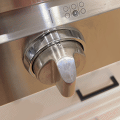
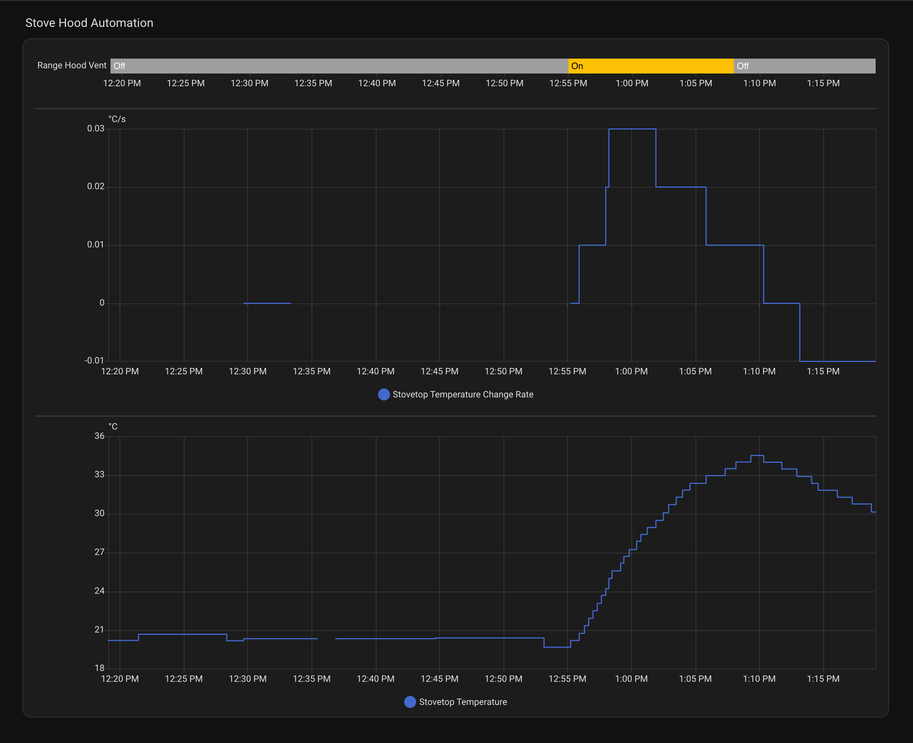

<h1 align="center">Smart Hood Vent Automation<br/>for Home Assistant</h1>

<p align="center">
  <strong>Automatically turn your range hood on and off based on cooking activity — no hardwired stove integration required.</strong>
</p>

<p align="center">
  <a href="https://www.home-assistant.io/"></a>
  <a href="https://github.com/azilnik/ha-hood-vent/blob/main/LICENSE"></a>
  <a href="https://github.com/azilnik/ha-hood-vent/stargazers"></a>
</p>

<p align="center">
  
</p>

---

## Why This Exists

Gas stoves [put out real pollutants](https://rmi.org/insight/gas-stoves-pollution-health) (NO2, CO, particulates), and the fix is just turning on your range hood. Problem is, I forget. [Most people do.](https://doi.org/10.1111/ina.12906) I have two small kids and read too many air quality studies, so I did the obvious thing and automated my range hood.

## How It Works

Most smart hood setups wait for your kitchen to hit a temperature threshold before kicking in. By then you've been cooking for 10 minutes. And when you stop, residual heat keeps the hood running long after.

This package watches the **rate of change** instead — how *fast* the temperature is rising or falling. Your hood turns on within 30–60 seconds of starting to cook and off within 2–3 minutes of stopping.

<p align="center">
  
</p>

Reading the dashboard top to bottom:

1. **Hood state** (top bar) — off, then on (yellow), then off again
2. **Temperature rate of change** (middle graph) — the derivative. Flat at zero when idle, spikes when cooking starts, drops back when you stop. This is what triggers the hood.
3. **Raw temperature** (bottom graph) — climbs from ~20°C to ~35°C during cooking. A threshold-based system would wait for this to cross some number. Rate of change catches it 10x faster by watching the *slope*, not the value.

> Want the full technical breakdown? See [How It Works](docs/how-it-works.md).

## What You Need

- **Home Assistant** up and running ([getting started guide](https://www.home-assistant.io/getting-started/))
- A [**Zigbee temperature sensor**](https://www.amazon.com/THIRDREALITY-Temperature-Humidity-Sensor-Lite/dp/B0F6CKHHDV) near your stove (~$15)
- A [**SwitchBot Bot**](https://www.amazon.com/SwitchBot-switch-button-controlled-compatible/dp/B07B7NXV4R) + [**Hub Mini**](https://www.amazon.com/SwitchBot-Thermometer-Hygrometer-Bluetooth-Temperature/dp/B07TTH451R) to press your hood's button (~$70), *or* a smart switch if your hood is hardwired
- A [**Zigbee coordinator**](https://www.amazon.com/SMLIGHT-SLZB-06-Coordinator-Zigbee2MQTT-Assistant/dp/B0BL6DQSB3) if you don't already have one (~$25–45)

> Full hardware recommendations with links and alternatives: [Hardware Guide](docs/hardware.md)

## Quick Start

The whole setup takes about 15 minutes once you have the hardware.

### 1. Add your device IDs to `secrets.yaml`

Find your entity IDs in **[Developer Tools → States](https://my.home-assistant.io/redirect/developer_states/)** and add these 3 lines to `/config/secrets.yaml`:

```yaml
hood_temperature_sensor: sensor.YOUR_TEMPERATURE_SENSOR
hood_humidity_sensor: sensor.YOUR_HUMIDITY_SENSOR
hood_switch: switch.YOUR_HOOD_SWITCH
```

> You can also copy [`secrets_example.yaml`](secrets_example.yaml) as a starting point.

### 2. Enable packages in `configuration.yaml`

Add this to your `configuration.yaml` (or under an existing `homeassistant:` section):

```yaml
homeassistant:
  packages:
    hood_vent: !include packages/hood_vent_package.yaml
```

### 3. Drop in the package file

Download [`hood_vent_package.yaml`](hood_vent_package.yaml) and put it in `/config/packages/`. No edits needed — it reads your secrets automatically.

### 4. Restart and go

Restart Home Assistant from **[Settings → System → Restart](https://my.home-assistant.io/redirect/server_controls/)**. After restart, head to **[Settings → Automations](https://my.home-assistant.io/redirect/automations/)** and you should see the hood vent automations. Toggle `input_boolean.hood_automation_enabled` to **on** and you're set.

## Next Steps

Once it's running, there are a few things worth checking out:

- **[Sensor Placement](docs/sensor-placement.md)** — where to mount the sensor matters a lot for responsiveness
- **[Dashboard Card](docs/dashboard.md)** — add a control panel with live rate-of-change graphs and tuning sliders
- **[Tuning Guide](docs/tuning.md)** — dial in the sensitivity for your specific kitchen and stove
- **[Troubleshooting](docs/troubleshooting.md)** — if something isn't working right

## Features

| Feature | What it does |
|---------|-------------|
| **Rate-of-change detection** | Responds to cooking activity, not absolute temp — way faster on and off |
| **Dual triggers** | Watches both temperature and humidity (steam from boiling triggers even when temp rise is slow) |
| **UI-adjustable thresholds** | Tune sensitivity with dashboard sliders — no more YAML editing after initial setup |
| **Manual override** | Manually toggle the hood and automation pauses for 30 min so it doesn't fight you |
| **Safety shutoff** | Auto-off after 2 hours max, just in case |

## File Reference

| File | Purpose | Edit needed? |
|------|---------|--------------|
| [`secrets_example.yaml`](secrets_example.yaml) | Template for your 3 entity IDs | **Yes** — copy into your `secrets.yaml` |
| [`hood_vent_package.yaml`](hood_vent_package.yaml) | All the HA config (sensors, automations, inputs) in one [package](https://www.home-assistant.io/docs/configuration/packages/) | No |
| [`lovelace_card.yaml`](lovelace_card.yaml) | Dashboard card YAML | **Yes** — replace 3 entity IDs before pasting |

## Contributing

Issues and PRs are welcome! If you adapt this for different hardware or improve the detection logic, please share.

## License

[MIT](LICENSE) — use freely, attribution appreciated.
