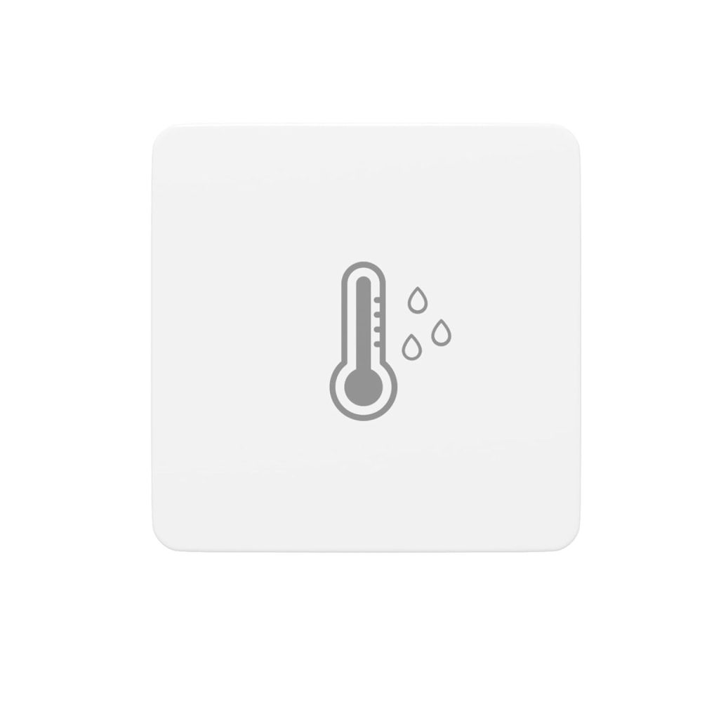
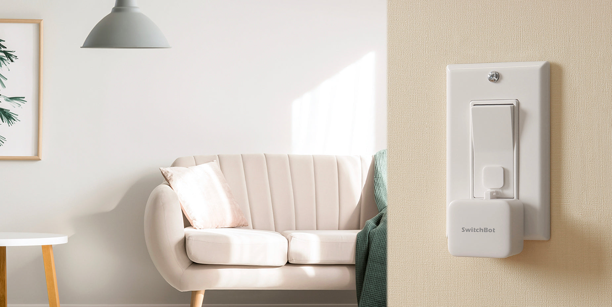
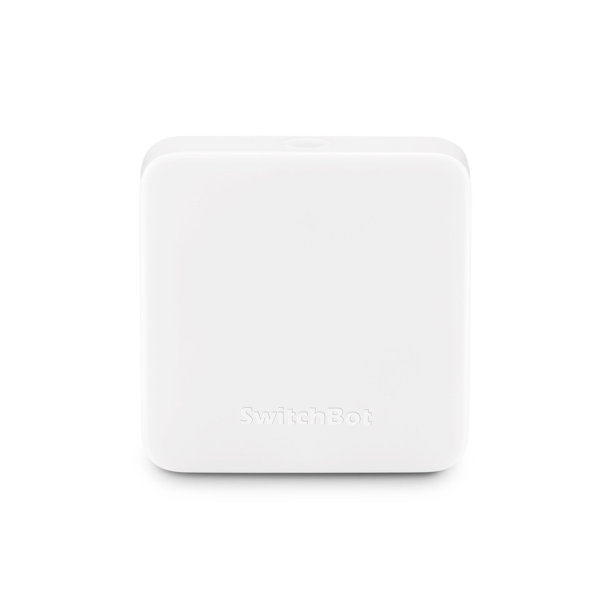
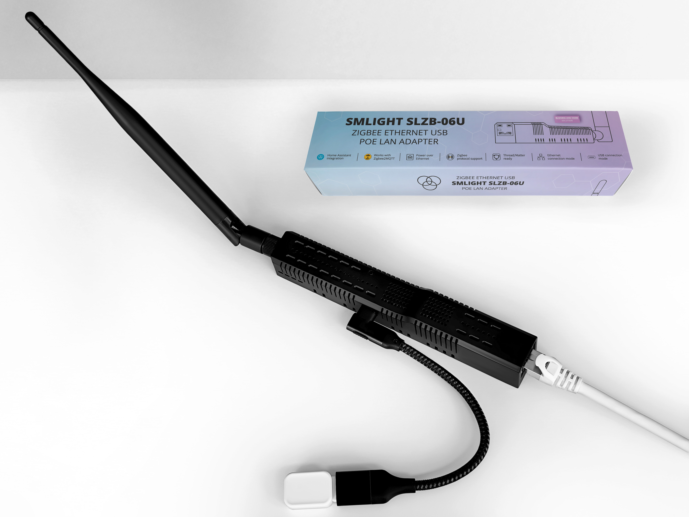

# Hardware Guide

You need three things: a temperature sensor, something to press your hood's button, and a Zigbee coordinator (if you don't already have one).

## Temperature & Humidity Sensor

This is the "eyes" of the automation — it detects cooking activity by measuring how fast the air is heating up.

<table>
  <tr>
    <td width="140"></td>
    <td>
      <strong><a href="https://www.amazon.com/THIRDREALITY-Temperature-Humidity-Sensor-Lite/dp/B0F6CKHHDV">Third Reality Zigbee Temperature & Humidity Sensor Lite</a></strong> 
      Reports temperature and humidity over Zigbee. Compact, battery-powered, easy to mount near the stove. Same accuracy as the full-size model at a lower price — you don't need the LCD screen for this automation. 
      <strong>~$15</strong>
    </td>
  </tr>
</table>

<strong>Alternative sensors</strong>

 

| Sensor | Notes | Price |
|--------|-------|-------|
| [Third Reality Sensor (with LCD)](https://www.amazon.com/THIRDREALITY-Zigbee-Temperature-Humidity-Sensor/dp/B0BN32XX24) | Same sensor with a small LCD screen for at-a-glance readings | ~$20 |
| [SONOFF SNZB-02](https://www.amazon.com/SONOFF-SNZB-02-Temperature-Humidity-Sensor/dp/B08BCHRH1P) | Very compact, wide HA support | ~$12 |

Any Zigbee temperature sensor that reports to HA will work. The key is frequent reporting intervals (ideally every 30–60 seconds).

## Hood Control (SwitchBot)

Unless your hood vent is already wired into a smart switch, you need a physical way to press the button. A SwitchBot Bot is a tiny robotic arm that mounts over your existing hood button and presses it on command.

<table>
  <tr>
    <td width="140"></td>
    <td>
      <strong><a href="https://www.amazon.com/SwitchBot-switch-button-controlled-compatible/dp/B07B7NXV4R">SwitchBot Bot</a></strong> 
      A tiny motorized arm that physically presses buttons. Sticks onto your hood with adhesive — no wiring, no modification to your hood. 
      <strong>~$30</strong>
    </td>
  </tr>
  <tr>
    <td width="140"></td>
    <td>
      <strong><a href="https://www.amazon.com/SwitchBot-Thermometer-Hygrometer-Bluetooth-Temperature/dp/B07TTH451R">SwitchBot Hub Mini</a></strong> 
      The Bot communicates over Bluetooth, but the Hub bridges it to your Wi-Fi network so Home Assistant can control it. You need one Hub for all your SwitchBot devices. 
      <strong>~$40</strong>  
      <em>Setup guide:</em> <a href="https://www.home-assistant.io/integrations/switchbot/">SwitchBot HA integration</a>
    </td>
  </tr>
</table>

<strong>Alternative hood controls</strong>

 

If your hood is hardwired (i.e., it's controlled by a wall switch rather than a button on the hood itself), you can use a smart relay instead:

| Device | Notes | Price |
|--------|-------|-------|
| Any Zigbee smart switch | Replaces your wall switch entirely | $15–30 |
| [Shelly Plus 1](https://www.shelly.com/en/products/shop/shelly-plus-1) | Wi-Fi relay, wires behind the switch | ~$12 |

## Zigbee Coordinator

This is the "radio" that lets Home Assistant talk to your Zigbee sensor. If you already use Zigbee devices with HA, you already have one — skip this.

<table>
  <tr>
    <td width="140"></td>
    <td>
      <strong><a href="https://www.amazon.com/SMLIGHT-SLZB-06-Coordinator-Zigbee2MQTT-Assistant/dp/B0BL6DQSB3">SMLIGHT SLZB-06</a></strong> 
      Connects over Ethernet, USB, or Wi-Fi. Supports PoE. Can be placed anywhere in your house for best Zigbee coverage — doesn't need to be plugged into the HA server directly. 
      <strong>~$45</strong>
    </td>
  </tr>
</table>

<strong>Alternative coordinators</strong>

 

| Coordinator | Notes | Price |
|-------------|-------|-------|
| [SONOFF Zigbee 3.0 USB Dongle Plus](https://www.amazon.com/SONOFF-Zigbee-Gateway-Universal-Assistant/dp/B09KXTCMSC) | Budget USB option, widely recommended for beginners | ~$25 |
| [SMLIGHT SLZB-06M](https://www.amazon.com/SMLIGHT-SLZB-06M-Ethernet-Zigbee2MQTT-Assistant/dp/B0CLCGV1RZ) | EFR32 chip variant of the SLZB-06 | ~$45 |

For help choosing, see the [Zigbee coordinator comparison](https://www.zigbee2mqtt.io/guide/adapters/) on the Zigbee2MQTT site.

## Total Cost

| Item | Price |
|------|-------|
| Temperature sensor | ~$15 |
| SwitchBot Bot | ~$30 |
| SwitchBot Hub Mini | ~$40 |
| Zigbee coordinator (if needed) | ~$25–45 |
| **Total** | **~$85–130** |

One-time purchase. No subscriptions. Everything runs locally.

## Prerequisites

If any of these are new to you, here are some helpful starting points:

### Home Assistant

- [What is Home Assistant?](https://www.home-assistant.io/getting-started/) — 5-minute overview
- [Installation guide](https://www.home-assistant.io/installation/) — pick your hardware and follow the steps
- [Onboarding walkthrough](https://www.home-assistant.io/getting-started/onboarding/) — first-time setup
- [Concepts & terminology](https://www.home-assistant.io/getting-started/concepts-terminology/) — entities, automations, integrations

> **Recommended hardware for beginners:** A [Raspberry Pi 4 (4 GB)](https://www.home-assistant.io/installation/raspberrypi) or an [Intel NUC / mini PC](https://www.home-assistant.io/installation/generic-x86-64) running Home Assistant OS.

### Zigbee

- [ZHA integration guide](https://www.home-assistant.io/integrations/zha/) — HA's built-in Zigbee support (easiest to set up)
- [Zigbee2MQTT](https://www.zigbee2mqtt.io/guide/getting-started/) — alternative with more advanced device support

### YAML Basics

You'll need to copy files and add 3 lines to `secrets.yaml`. No need to write YAML from scratch.

- [HA's YAML intro](https://www.home-assistant.io/docs/configuration/yaml/) — syntax basics
- [HA secrets.yaml guide](https://www.home-assistant.io/docs/configuration/secrets/) — how `!secret` works
- [File Editor add-on](https://www.home-assistant.io/common-tasks/os/#installing-and-using-the-file-editor-add-on) — edit config files in your browser (no SSH needed)
