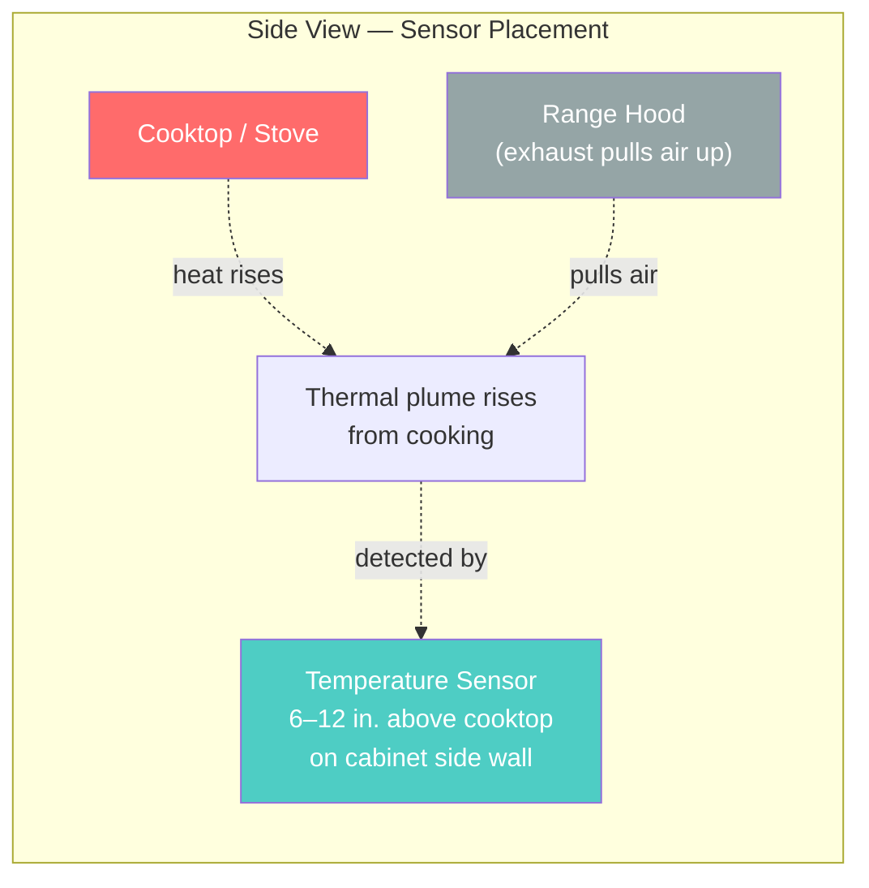

# Sensor Placement

Where you mount the sensor matters a lot. It needs to catch the **thermal plume** rising from your cooking — not direct burner heat or ambient room temperature.

## Good Placement

- 6–12 inches above the cooktop, on a cabinet side wall or the underside of an upper cabinet
- Off to one side of the burners, not directly centered above one

## Bad Placement (and Why)

- **Directly above a burner** — readings spike unrealistically high, causing false triggers
- **On the hood itself or near the exhaust vent** — airflow from the hood disrupts readings
- **Near a window, exterior door, or HVAC vent** — drafts cause false readings
- **Too far away (across the kitchen)** — sensor won't detect the cooking plume fast enough

> **Tip:** Use adhesive command strips or Velcro for easy repositioning while you dial things in.
